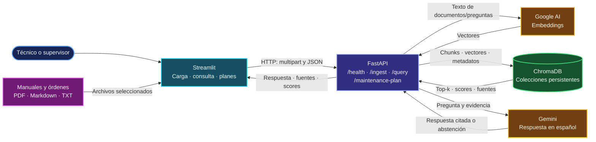

# Asistente RAG de mantenimiento industrial

Proyecto académico que demuestra los conceptos de la clase de Inteligencia Artificial mediante una aplicación RAG para consultar órdenes de trabajo de servicio y manuales de equipos de imprenta y preprensa. Streamlit es la interfaz; FastAPI procesa cargas y consultas, Google AI genera embeddings y respuestas, y ChromaDB conserva el índice vectorial.

## Índice del proyecto

- [Arquitectura actual](#arquitectura-actual)
- [Estructura del proyecto](#estructura-del-proyecto)
- [Corpus de ejemplo y constructor](#corpus-de-ejemplo-y-constructor)
- [Instalación e instrucciones de uso](#instalación-e-instrucciones-de-uso)
- [API](#api)
- [Reporte del proyecto](report.md)
- [Checklist de la rúbrica (archivo local)](checklist.md)

## Arquitectura actual

Streamlit solo se comunica con FastAPI. La API extrae y fragmenta documentos, solicita embeddings, persiste los fragmentos en Chroma y recupera evidencia para Gemini. Las preguntas en español también pueden usar una consulta traducida al inglés; las fuentes citadas conservan el texto original. La aplicación permite filtrar por tipo de fuente y equipo.

## Estructura del proyecto

| Ruta | Contenido |
|---|---|
| `app/` | API, extracción y fragmentación, embeddings, recuperación y generación |
| `ui/` | Interfaz Streamlit para cargar documentos, consultar y proponer planes |
| `data/example_corpus/` | Guías técnicas, referencias aprobadas y órdenes sintéticas |
| `corpus_builder/` | Scripts, catálogos y guías para preparar el corpus de demostración |
| `chroma/` | Índice vectorial persistente incluido en el proyecto y versionable en Git |
| `imagenes/` | Capturas de ingesta y consultas incluidas en el reporte |

La organización adapta a la aplicación actual los conceptos de las notebooks en `../inteligencia-artificial/RAG/Notebooks/`: colecciones persistentes, recuperación top-k, embeddings Google y respuestas condicionadas por evidencia.

## Corpus de ejemplo y constructor

El corpus es ficticio para permitir pruebas reproducibles sin usar registros operativos de clientes. Incluye cinco guías Markdown para equipos de impresión, corte, prensa digital, preprensa y servicios de apoyo, además de 100 órdenes sintéticas. Estas describen identificador y equipo, fechas, síntoma, diagnóstico, causa, acciones, piezas, tiempo de inactividad, estado y recomendaciones. No sustituyen documentación oficial ni autorizan intervenciones.

Consulta [`corpus_builder/README.md`](corpus_builder/README.md) y la [guía completa de preparación, ingesta y persistencia](corpus_builder/docs/guia_inicio_a_fin.md). Los scripts se ejecutan desde la raíz de este proyecto. Para identificar las fuentes técnicas pertinentes, revisa también las guías de [manuales](corpus_builder/docs/manuales.md) y [órdenes sintéticas](corpus_builder/docs/ordenes_sinteticas.md).

## Instalación e instrucciones de uso

Los requisitos son Python 3.10 o posterior, dependencias de `requirements.txt` y una clave de Google AI Studio configurada en `.env` a partir de `.env.example`. No compartas la clave ni agregues `.env` a Git.

La guía [`instrucciones.md`](instrucciones.md) contiene los pasos completos para instalar y arrancar FastAPI y Streamlit, cargar archivos, filtrar consultas, generar planes y resolver errores frecuentes. También explica formatos aceptados, filtros, citas, scores y abstención.

## API

FastAPI ofrece `GET /health`, `POST /ingest`, `POST /query` y `POST /maintenance-plan`. Con la API iniciada, la documentación interactiva está disponible en <http://localhost:8000/docs> y el estado del índice en <http://localhost:8000/health>. La interacción habitual se realiza desde Streamlit en <http://localhost:8501>.

## Reporte y seguimiento

- [Report](report.md): resultados de ingesta, consultas, scores, abstención, incidencias y evolución propuesta; incluye las capturas del proyecto.
- [Checklist de la rúbrica](checklist.md): checklist local de aceptación y entrega con pasos para completar las evidencias pendientes. Este archivo se excluye de Git intencionalmente.
