# Report

## Corpus e ingesta

El proyecto trata del mantenimiento de equipos de imprenta y preprensa. La primera evidencia muestra cinco guías Markdown y 14 fragmentos. Después se indexaron 100 órdenes sintéticas, una por PDF; el índice indicó 105 documentos (5 manuales y 100 órdenes) y 114 fragmentos (14 y 100). Las cinco guías suman aproximadamente 2,804 palabras. La aplicación usa ventanas de 300 palabras con overlap de 60, conserva la página como metadato cuando existe y configura `gemini-embedding-001` para embeddings y `gemini-3.8-flash` para generación.

FastAPI extrae y fragmenta documentos, solicita embeddings y persiste los fragmentos en Chroma. En consulta aplica el filtro seleccionado (ambas fuentes, manuales u órdenes, opcionalmente por equipo), recupera vecinos y envía la pregunta y evidencia a Gemini. Streamlit muestra respuesta, fuentes, fragmentos y scores. Para preguntas en español también se consulta una traducción inglesa; las citas conservan el texto original.

### Evidencia de ingesta

Primera carga: cinco guías y 14 fragmentos.

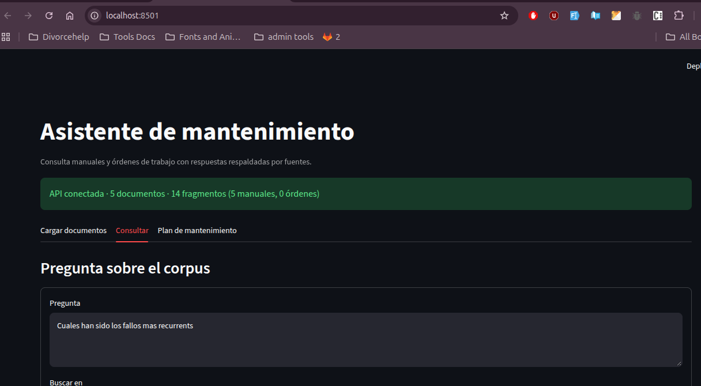

La carga de órdenes confirmó 100 documentos y 100 fragmentos nuevos o actualizados.

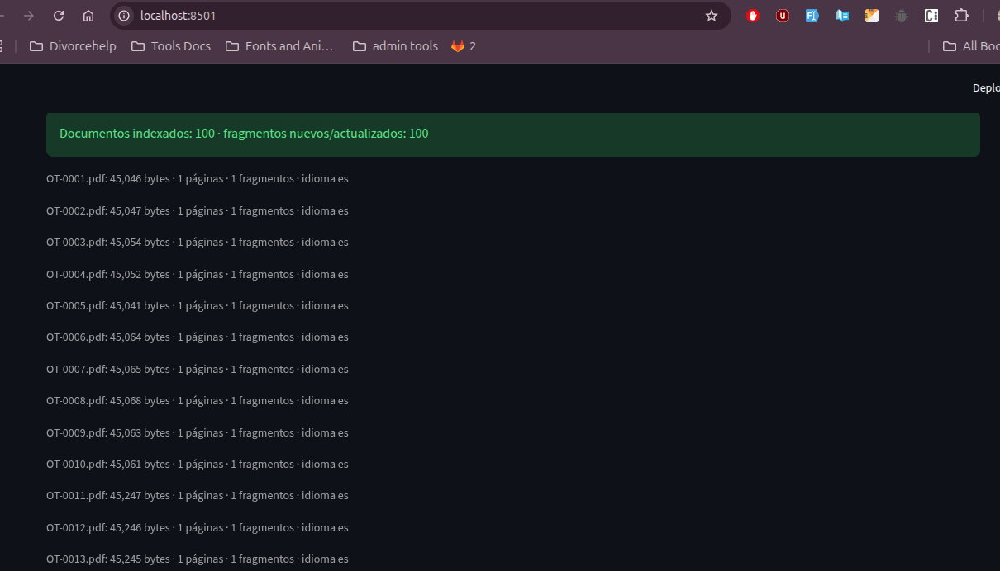

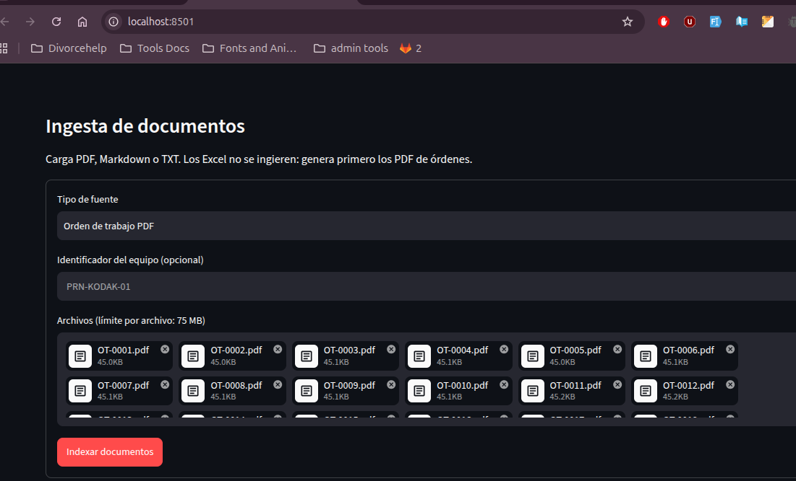

## Consultas y resultados

### Fallas recurrentes

La respuesta explica que el corpus no permite obtener estadísticas globales y menciona recurrencias cualitativas en limpieza, alimentación, calidad e interrupciones de preprensa. Los scores visibles oscilan entre 0.682–0.705 y 0.673–0.696.

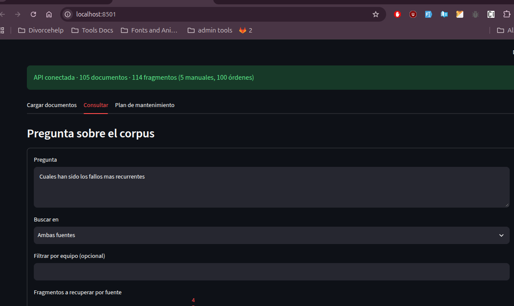

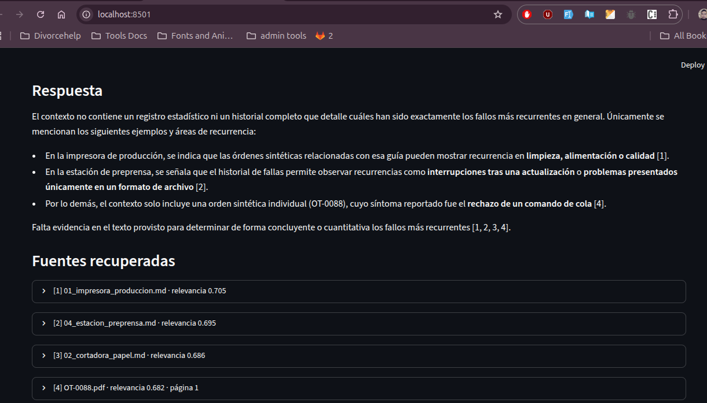

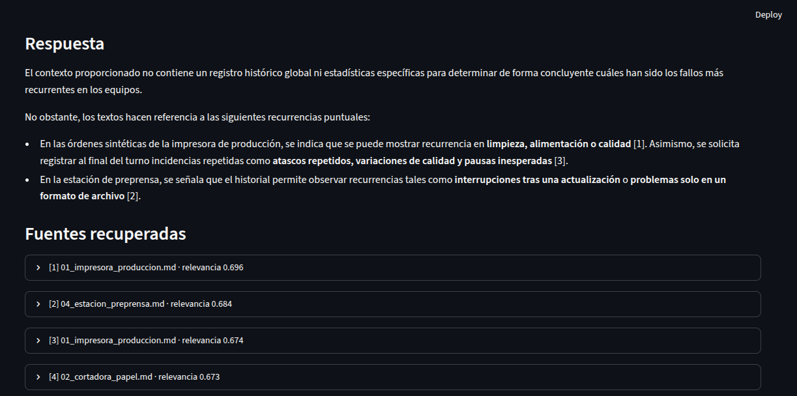

### Atasco de papel

Para la pregunta sobre el atasco de papel en HP LaserJet Enterprise MFP 5602, la respuesta recomienda registrar la ubicación, retirar el papel accesible según la guía y realizar una prueba controlada. Las cuatro órdenes recuperadas muestran scores entre 0.732 y 0.754.

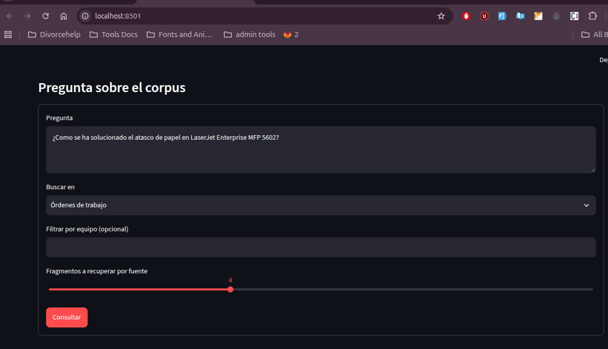

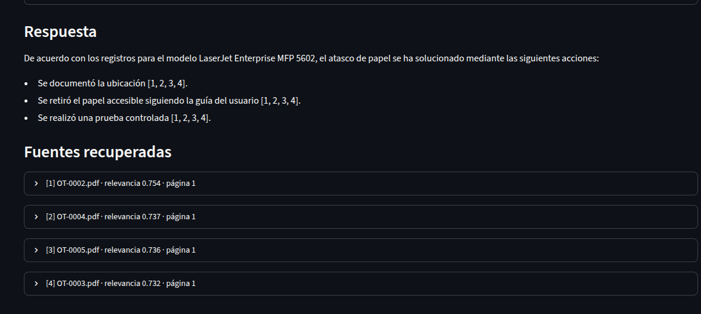

### Rutina preventiva

La respuesta sobre la impresora de producción resume las revisiones antes del turno, la limpieza según las indicaciones del fabricante y el registro de consumibles e incidencias. Los cuatro fragmentos muestran scores entre 0.692 y 0.773.

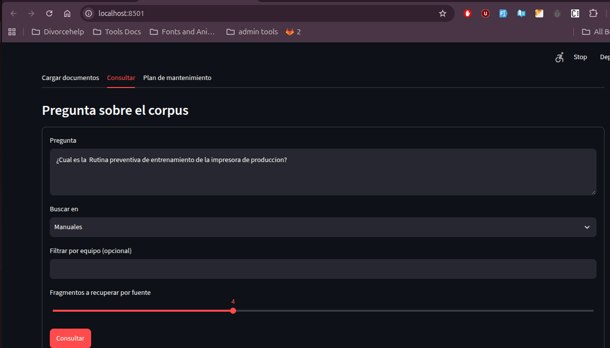

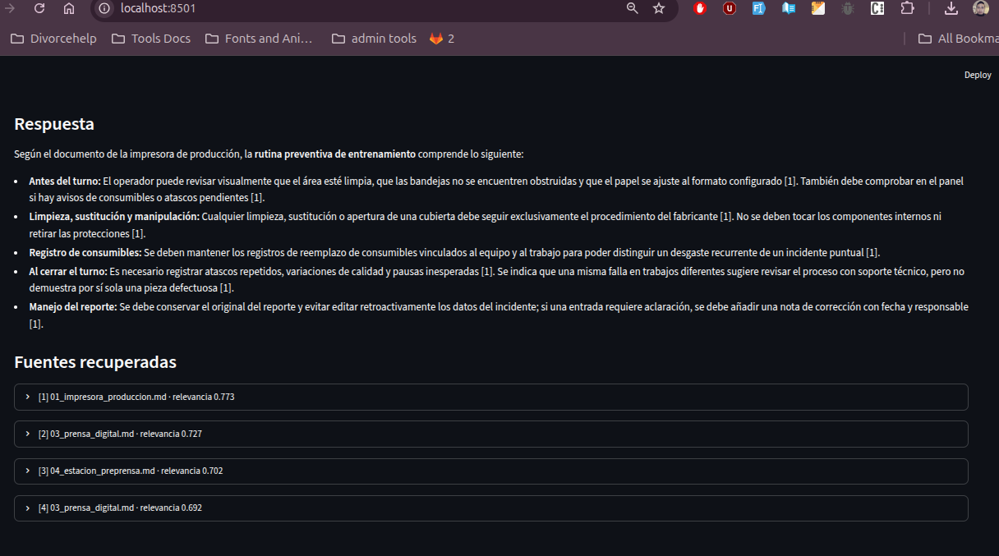

### Pregunta fuera del dominio

Ante la pregunta sobre medicamentos para la diarrea, el sistema reconoce que los documentos tratan de equipos de impresión y se abstiene. Los scores recuperados (0.522–0.536) no bastan para determinar que una fuente sea pertinente. La configuración usa un umbral de 0.35; Gemini también debe abstenerse cuando el contenido recuperado no responde la pregunta.

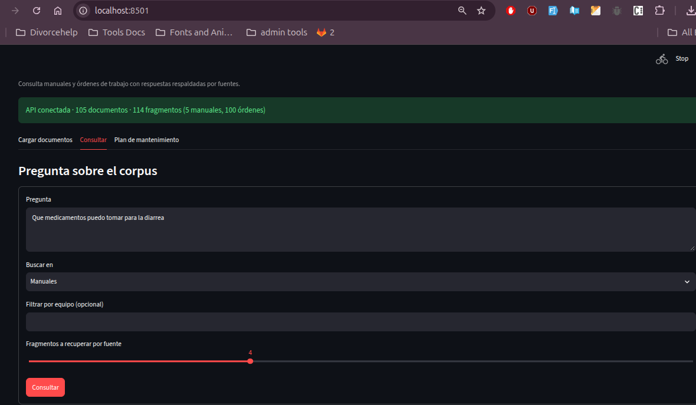

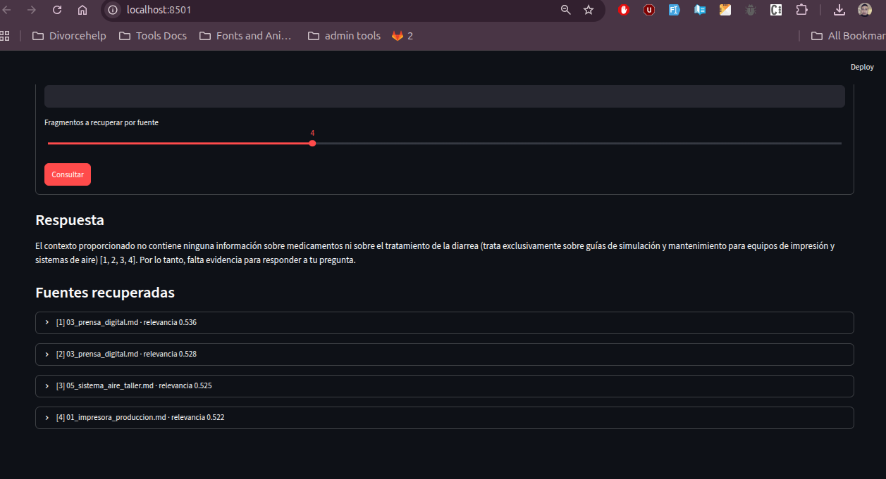

## Evidencia directa de la API y persistencia

Las siguientes comprobaciones se realizaron directamente contra FastAPI desde `/docs`, mediante `POST /query`; son independientes de las consultas mostradas antes desde Streamlit.

### Respuesta citada por API

La solicitud pregunta cómo se solucionó un atasco de papel en una LaserJet Enterprise MFP 5602 y limita la búsqueda a órdenes de trabajo. La API respondió con HTTP 200, incluyó una respuesta con citas numeradas (`[1, 2, 3, 4]`) y devolvió las fuentes recuperadas en el cuerpo JSON.

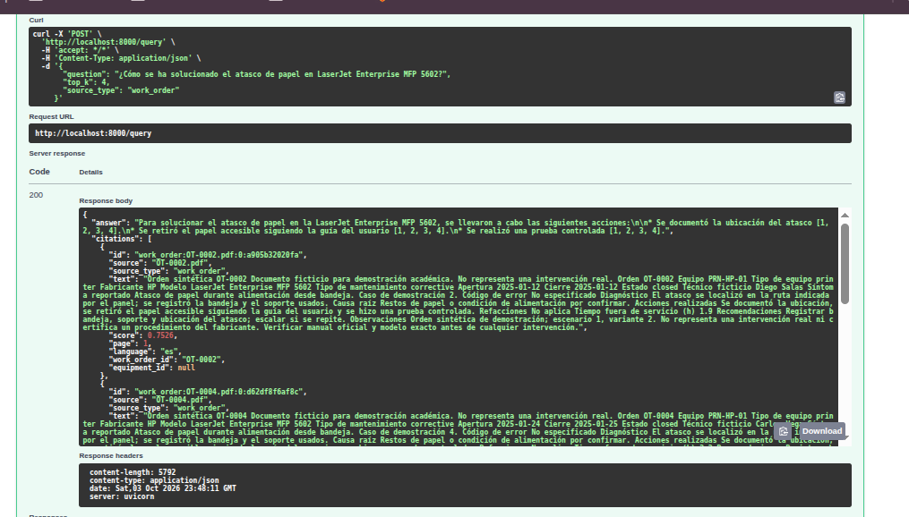

### Abstención fuera del dominio por API

La solicitud sobre medicamentos para la diarrea se envió directamente a `POST /query`. La API respondió con HTTP 200 y el texto indica que el contexto no contiene información suficiente para responder; la solicitud no produjo un error del servidor.

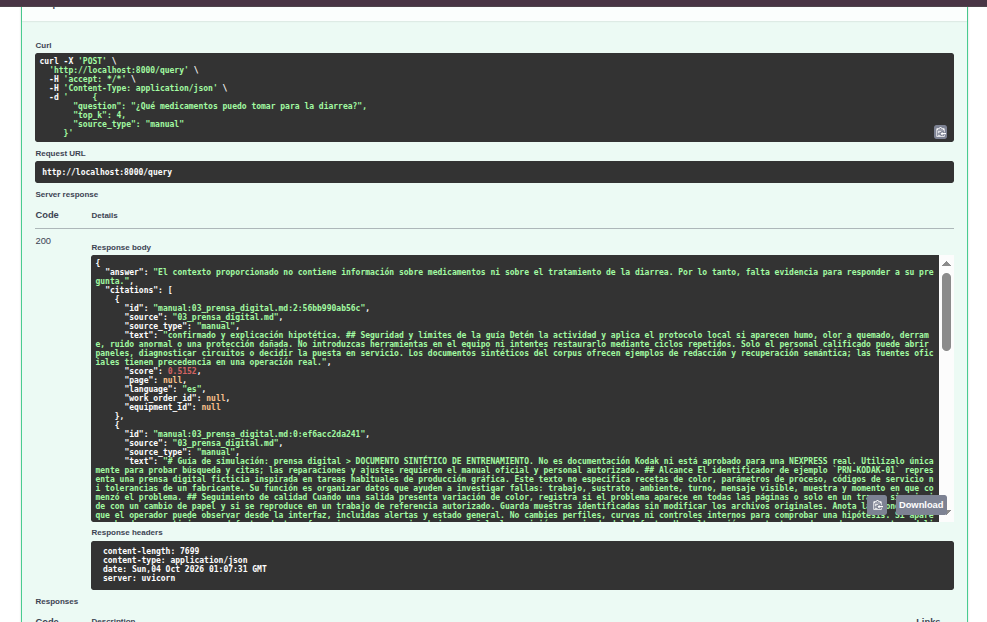

### Persistencia después de reiniciar FastAPI

La captura de la terminal muestra el nuevo arranque de Uvicorn y la finalización del inicio de la aplicación. Las respuestas de `GET /health` antes y después del reinicio muestran el mismo estado (`ok`) y los mismos conteos: 105 documentos y 114 fragmentos (5 documentos y 14 fragmentos de manuales; 100 documentos y 100 fragmentos de órdenes). Esto demuestra que el índice seguía disponible tras reiniciar FastAPI.

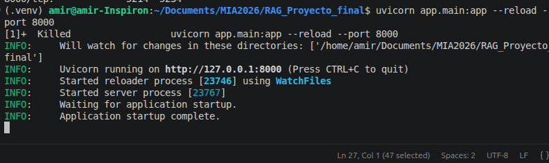

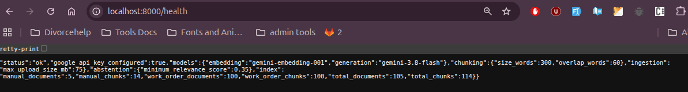

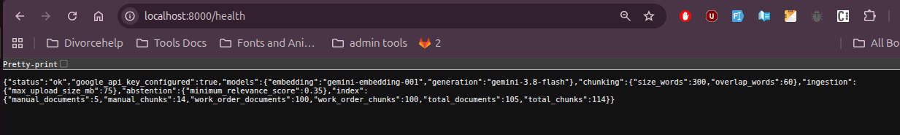

## Incidencias técnicas

Durante las pruebas con modelos gratuitos hubo intermitencias de cuota y disponibilidad, incluidos errores 429 y 503. La API escribe errores y trazas en `logs/ingestion.log`, con rotación. Para ciertos errores 429 que incluyen un intervalo de reintento, espera ese intervalo y reintenta hasta dos veces. Esto ayuda a diagnosticar y recuperar fallos temporales, pero no elimina los límites ni la saturación del proveedor.

Las capturas de esta sección complementan las pruebas de Streamlit con solicitudes directas a los endpoints de FastAPI. Las consultas citada y de abstención devolvieron HTTP 200, y `/health` conservó sus conteos después del reinicio.

## Conclusión y evolución

La implementación actual combina Streamlit, FastAPI, Google AI y Chroma con citas, filtros por fuente y equipo, y abstención. En una siguiente etapa, planes de mantenimiento podrían conectarse mediante MCP a una API que registre datos en MySQL. Un plan o reporte podría generarse como PDF, revisarse e incorporarse al índice vectorial. El formato de documentos facilita sustituir gradualmente órdenes y manuales ficticios por fuentes reales autorizadas. Modelos más robustos y disponibles podrían reducir las intermitencias observadas.
